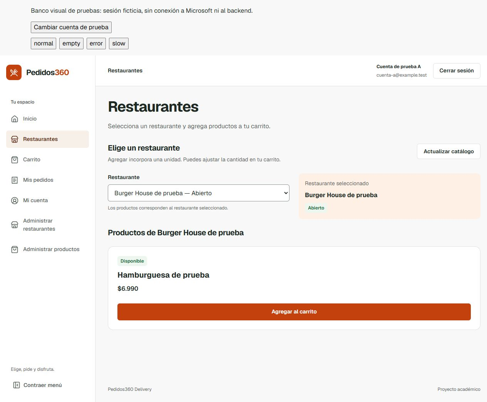
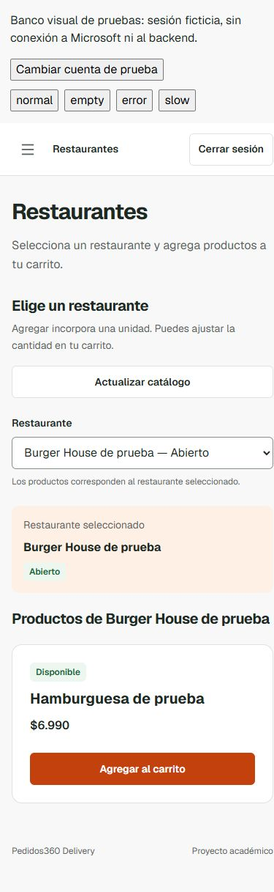

# Issue #60 — Fase 4 CLIENTE: Restaurantes y Productos

Estado: READY FOR INDEPENDENT AUDIT. Base: `66978e38a2ba1ba592cc9d679517e8d753446e12`, merge de PR #102 incorporado. Rama: `codex/60-client-catalog`. El HEAD definitivo se registra en GitHub y en el informe de entrega; este documento no incluye su propio hash de commit.

## Cambio y compatibilidad

La ruta existente `/restaurantes` presenta selector etiquetado con ayuda vinculada, resumen del restaurante seleccionado y productos con nombre, precio CLP y disponibilidad textual. Reutiliza los componentes y tokens existentes. Distribución responsive, selector/acción de agregar de 44 px, foco visible y mensajes de carga/error/vacío/éxito. Un restaurante cerrado o producto no disponible conserva la acción deshabilitada. Los nombres largos pueden dividirse sin desbordar.

Los handlers de selección, consulta, recuperación y agregado conservan su comportamiento: una unidad por acción, mismo ID de producto y bloqueo del controller durante escritura. No se inventan datos ni se cambian cantidades, precios o validaciones. El error de catálogo se anuncia una vez y conserva `role=alert`, `tabIndex=-1` y foco programático. El vacío no produce una lista semántica vacía.

| Archivo | Alcance |
| --- | --- |
| `frontend/src/features/restaurantes/RestaurantesPage.jsx` | Carga de estilos acotados y jerarquía de título |
| `frontend/src/features/restaurantes/RealCatalogPanel.jsx` | Presentación de carga, recuperación/sesión y éxito; mismos handlers |
| `frontend/src/features/carrito/RealCatalog.jsx` | Selector, resumen, productos y estados con componentes compartidos |
| `frontend/src/features/restaurantes/catalog.css` | Layout responsive limitado al catálogo CLIENTE |
| `frontend/tests/clientCatalog.test.js` | Seis regresiones de presentación e interacción |
| `frontend/tools/fixtures/previewApi.mjs` | Escenarios del banco local y simulación del POST de agregado ya existente |
| `frontend/DESIGN.md` | Registro del alcance CLIENTE |
| Este informe, manifiesto y capturas | Evidencia reproducible |

Controllers/adaptadores, rutas, MSAL, DTO, endpoints públicos, backend, administración PR #62, Checkout, Pagos y Pedidos permanecen sin diff. `RealCatalog` solo lo consume el panel CLIENTE. Sigue consultando `/restaurantes` y `/productos/restaurante/{id}` mediante BFF y agregando por `POST /carrito/items` con `{productoId,cantidad:1}`. No hay dependencia directa del frontend con RabbitMQ ni cambio de flags operativos. #60 permanece abierto; fase 6 fuera del alcance.

## Pruebas ejecutadas el 2026-10-09

Todas desde `frontend/`, después del cambio definitivo:

| Validación | Resultado | Tipo de evidencia |
| --- | --- | --- |
| `node --test tests/clientCatalog.test.js tests/cartHttpAdapter.test.js tests/cartService.test.js` | 41 PASS, 0 fallos/omisiones | JSX y handlers reales; hooks/transporte controlados; contratos/controller existentes |
| `npm test` | 240 PASS, 0 fallos/omisiones | Suite frontend completa, incluye seis casos nuevos |
| `npm run lint` | Exit 0 | **oxlint**, no ESLint |
| Build producción HTTP | Exit 0 | `VITE_PEDIDOS_CARRITO_MODE=HTTP` solo en proceso local |
| Build producción RABBITMQ | Exit 0 | `VITE_PEDIDOS_CARRITO_MODE=RABBITMQ` solo en proceso local |
| Navegador desktop 1280×900 | Revisado | Aplicación real con banco loopback de fixtures |
| Navegador móvil 390×844 y 320×780 | Revisado | Sin scroll horizontal; selector/botón 44 px |

Las seis regresiones nuevas cubren asociación y lectura solo después de seleccionar, precio CLP, disponibilidad, bloqueo por operación pendiente, restaurante cerrado, vacíos diferenciados, 503, timeout y 403 con foco/recuperación sin agregado. La suite existente cubre rutas/sesión, cancelación al cambiar sesión, exclusión de escrituras duplicadas, administración, Checkout HTTP/RabbitMQ y recuperación de PR #102; no se alteraron sus tests.

Revisión manual del navegador: selección por ArrowDown/Enter, Tab hacia agregar con outline de 2 px, agregado por Enter; durante respuesta lenta quedan deshabilitados selector/actualizar/agregar. El banco confirmó una sola unidad adicional (cantidad 2→3) y mostró el mensaje de éxito. También se revisaron producto no disponible, catálogo vacío, sin productos, error 503 con foco en alert, 403, cambio de cuenta con selección/mensaje reiniciados y logout con ruta protegida. Se confirmó el vacío sin lista tras el ajuste final de accesibilidad.

Los colores son los tokens existentes: texto `#1f2923`, muted `#58635c`, blanco sobre primary `#c2410c`, success `#166534` sobre `#edf7ef`; texto y disponibilidad no dependen solo del color. Cálculo local de contraste: texto/blanco 15.00:1; muted/background 5.88:1; blanco/primary 5.18:1; success/success-soft 6.50:1; muted/primary-soft 5.62:1. La revisión no es una certificación WCAG ni una prueba con lector de pantalla.





## Reproducción y hashes

`frontend-60-client-catalog-tests.json` contiene SHA-256 de fuentes, logs y capturas. Fuentes normalizadas a UTF-8/LF para que el hash sea estable con `core.autocrlf`. Logs y capturas usan bytes originales. El directorio local completo está identificado en el manifiesto; las dos capturas principales están también versionadas.

Para builds locales desde PowerShell en `frontend/`:

```powershell
$env:VITE_PEDIDOS_CARRITO_MODE='HTTP'
npm run build -- --outDir "$env:TEMP/p360-client-catalog-http"
$env:VITE_PEDIDOS_CARRITO_MODE='RABBITMQ'
npm run build -- --outDir "$env:TEMP/p360-client-catalog-rabbitmq"
Remove-Item Env:VITE_PEDIDOS_CARRITO_MODE
```

`npm run preview:ui` inicia el banco loopback en un puerto efímero anunciado. Abrir su URL, navegar a Restaurantes y seleccionar el restaurante. Los botones normal/empty/error/slow son fixtures y recargan el banco. Para conservar la selección durante pruebas de estados, enviar desde PowerShell al puerto anunciado y pulsar **Actualizar catálogo**:

```powershell
Invoke-WebRequest -Uri 'http://127.0.0.1:PUERTO/__preview/scenario' -Method Post -Body 'catalog-unavailable'
```

Repetir con `catalog-empty-products`, `catalog-denied`, `empty`, `error`, `normal`. `slow` permite observar el bloqueo durante agregado. El POST simulado usa el contrato existente; no añade un endpoint al backend. Las fixtures y sus tokens no entran al bundle productivo ni son fallback.

## Límites y riesgos

No se ejecutaron Entra live, servicios backend reales, PostgreSQL, RabbitMQ ni AWS. Estas pruebas no acreditan autorización operacional, aislamiento de datos backend o despliegue. La comprobación de cambio de cuenta es de la sesión ficticia del banco y complementa los tests existentes.

Ambos builds conservan aviso de chunk principal >500 kB (~622 kB minificado). No se introduce una optimización de bundle fuera del alcance. No hay dependencias nuevas ni cambios de coordinación. Los requisitos operativos de #70/#71/#72 siguen pendientes en sus tareas; esta rama no los ejecuta ni los declara resueltos.

Sin merge, cierre de issues, fase 6, cambios de backend/administración/Checkout o activaciones. Esperar auditoría independiente.
